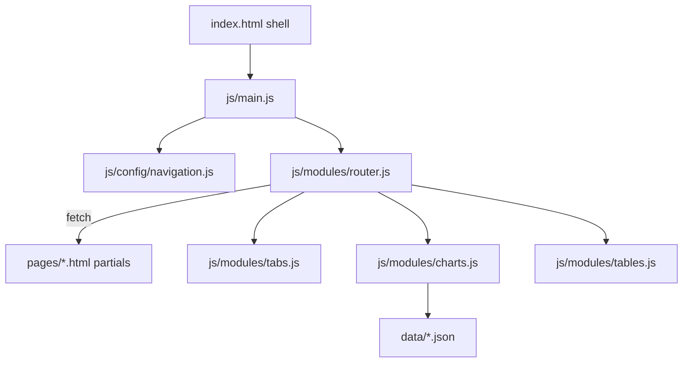

# CLAUDE.md — AI context for CP+R COO Dashboard

Instructions for AI assistants (Claude Code, Cursor, etc.) working in this repository. The site owner is not a developer; keep changes minimal, localized, and explain which files changed in plain language in chat responses.

## Project identity

This is a **static executive dashboard** for CP+R FY 25/26 COO reporting. It is plain HTML, CSS, and JavaScript — **no backend, no build step, no framework**. Files are served as static assets, intended for **GitHub Pages** (hash routing works without server rewrites).

The app is a **single-page shell** (`index.html`) that loads HTML partials from `pages/` at runtime via `fetch()`. Chart data and heatmap matrices live in `data/*.json`. Everything else (KPIs, table rows, narrative text) is **inline HTML** in page partials.

**Requires HTTP.** Opening `index.html` via `file://` will fail because `fetch()` cannot load partials or JSON. Always serve locally before verifying changes.

## Architecture



**Bootstrap flow:** `index.html` loads Chart.js (UMD global) and `js/main.js` (ESM). `main.js` renders the sidebar from `navigation.js` and starts the hash router. On each route change the router fetches `pages/{routeId}.html`, injects it into `#page-root`, then runs `initTabs`, `initCharts`, `initTables`. Previous route instances are destroyed first.

**Routes:** Hash URLs map to partial filenames. Examples:

| URL hash | Partial |
|----------|---------|
| `#overview` (default) | `pages/overview.html` |
| `#people` | `pages/people.html` |
| `#partnerships` | `pages/partnerships.html` |
| `#partnerships/referrals` | Same partial; sub-view switched via `data-subnav` |
| `#clinical`, `#onboarding`, `#em-performance`, `#tech`, `#fy2627` | `pages/{id}.html` |

Nav items and default route are defined in `js/config/navigation.js`. The sidebar is the single source of truth for top-level sections.

## Directory map

| Path | Responsibility | Edit when… |
|------|----------------|------------|
| `index.html` | Shell: CSS links, sidebar mount, `#page-root`, Chart.js, `js/main.js` | Adding global CSS, vendor scripts, or shell layout — **not** page content |
| `pages/{id}.html` | Content partials: KPIs, tables, narrative | User changes numbers, copy, tables, or section layout |
| `js/config/navigation.js` | Sidebar items, icons, titles, `DEFAULT_ROUTE` | Adding, renaming, or removing a top-level section |
| `js/modules/router.js` | Hash parsing, partial fetch, init/destroy lifecycle | New route types or sub-route behavior |
| `js/modules/layout.js` | Sidebar HTML, active nav, `document.title` | Nav chrome changes |
| `js/modules/tabs.js` | Tab, subnav, and chart-view switching via `data-*` | Tab interaction bugs — **not** content |
| `js/modules/charts.js` | Chart.js init from canvas attributes; heatmap rendering | New chart types or chart wiring |
| `js/modules/tables.js` | Sortable tables; delegates heatmap load to `charts.js` | Table UX enhancements |
| `js/config/chart-theme.js` | Chart.js colors, fonts, bar options | Chart styling only |
| `css/tokens.css` | Brand colors, `--accent`, `[data-accent]` overrides | Theme/token changes |
| `css/layout.css` | Sidebar, main area, page chrome, overview grid | Shell layout |
| `css/components/*.css` | Shared UI: tabs, stats, panels, tables, charts | Reusable component styling |
| `css/components/partnerships.css` | Partnership-specific layout (pillars, projections) | Partnership-only visual patterns |
| `data/*.json` | Chart series and heatmap matrix | Large numeric datasets (partnerships only today) |
| `assets/vendor/` | Pinned third-party (Chart.js UMD) | Vendor upgrades |

**Do not create** per-page CSS files, per-page JS files, or duplicate nav/tab logic inside HTML partials.

## Page partial contract

Every file in `pages/` must follow this contract:

1. **HTML fragment only** — no `<html>`, `<head>`, `<body>`, sidebar, or `<script>` tags.
2. **Root wrapper with metadata** on the outermost element:

```html
<div data-route-id="people" data-accent="yellow" data-page-title="CP+R · People">
```

- `data-route-id` must match the filename (`people.html` → `people`) and a `NAV_ITEMS` entry.
- `data-accent` sets the section tab color. Options: `yellow`, `green`, `pink`, `blue` (defined in `css/tokens.css`).
- `data-page-title` becomes `document.title` when the page loads.

3. **Declarative behavior** — use `data-*` attributes. Never add inline `onclick` handlers or page-local `<script>` blocks.
4. **Content inline in HTML** — KPI values, table rows, quotes, and narrative text belong in the partial, not in JS or JSON (unless chart/heatmap data).

### Current pages

`overview`, `partnerships`, `clinical`, `onboarding`, `em-performance`, `people`, `tech`, `fy2627`

## Declarative behavior patterns

Extend these patterns; do not reinvent tab/chart/table logic in new code.

| Pattern | Markup | Handled by |
|---------|--------|------------|
| Section tabs | `data-tabs="{group}"` on `<nav>`, `data-tab` on buttons, `data-panel` + `data-tab-group="{group}"` on `<section>` | `tabs.js` |
| Partnerships sub-views | `data-subnav` on buttons, `data-subpage` on panels; hash `#partnerships/referrals` | `tabs.js` + `router.js` |
| Chart view switcher | `data-chart-select` on buttons, `data-chart-view` on panels | `tabs.js` |
| Charts | `<canvas data-chart="key" data-chart-src="data/….json">` | `charts.js` |
| Inline chart config | `data-chart-config='{"preset":"…",…}'` on canvas (supported; unused today) | `charts.js` |
| Sortable table | `<table class="data-table" data-table-sortable>` with `<th>` headers | `tables.js` |
| Heatmap table | `<table class="data-table data-table--heatmap" data-heatmap="data/….json">` | `tables.js` → `charts.js` |

**Custom events** for cross-module coordination: `tabs:change`, `subpage:change`, `chartview:change`. Charts lazy-init when their panel, subpage, or chart view becomes active.

**Router lifecycle:** on route change, `destroyTabs` → `destroyCharts` → `destroyTables` run before loading the next partial. Any new interactive module must export matching `init*` and `destroy*` functions and be wired in `router.js`.

## Content vs data — decision tree

```
Change a number, label, table row, or narrative text
  → Edit the relevant pages/*.html partial only

Change chart series or heatmap matrix (many data points)
  → Edit data/*.json; HTML stays as wiring only

Add a new top-level dashboard section
  → 1) Create pages/{id}.html following the partial contract
     2) Add entry to js/config/navigation.js
     3) Add overview card link in pages/overview.html if appropriate
     4) Reuse css/components/*; add page-specific CSS only if truly unique (see partnerships.css)

Add interactivity
  → First check if existing data-* patterns cover it
  → Only add JS in js/modules/ if no pattern exists; never inline in HTML
```

**CSS bar charts** (funnel steps, NACR bars, arc rows): keep as HTML + CSS in partials. Do **not** migrate to Chart.js unless the data is genuinely time-series or categorical chart data.

**JSON files today:**

- `data/partnerships-charts.json` — `fyVolume` and `seasonality` presets for Chart.js
- `data/partnerships-heatmap.json` — monthly referral volume matrix for the heatmap table

## Hard constraints (anti-drift)

Never do these unless the user explicitly requests them:

- Add React, Vue, Angular, or a build tool (Vite, webpack, etc.)
- Put `<script>` tags or `onclick` handlers in page partials
- Duplicate `:root` tokens, sidebar markup, or `showTab()`-style inline JS in HTML
- Create new monolithic single-file HTML dashboards at the repo root
- Add API calls, a CMS, or dynamic data fetching beyond static JSON files
- Introduce global mutable state — encapsulate in modules with init/destroy lifecycle
- Modify files the user did not ask about

## Common request recipes

| User request | Files to touch |
|--------------|----------------|
| Update a KPI or figure | Relevant `pages/*.html` (often `pages/overview.html` too for hero strip) |
| Add/remove a table row | Relevant `pages/*.html` |
| Change sidebar label or icon | `js/config/navigation.js` |
| Add a tab within a section | Relevant `pages/*.html` markup only — `tabs.js` handles clicks |
| Update chart or heatmap data | `data/partnerships-charts.json` or `data/partnerships-heatmap.json` |
| Change brand colors | `css/tokens.css` |
| Add a new top-level page | `pages/{id}.html` + `js/config/navigation.js` + optional `pages/overview.html` link |
| Fix tab/chart not appearing | Check `data-*` wiring in partial first; only then `js/modules/tabs.js` or `charts.js` |

## Verification runbook

Run after any change:

```bash
python3 -m http.server 8000
```

Open `http://localhost:8000/index.html#overview` and check:

- No console errors or warnings caused by the change
- All hash routes load: `#overview`, `#people`, `#clinical`, `#onboarding`, `#em-performance`, `#tech`, `#partnerships`, `#partnerships/referrals`, `#fy2627`
- Sidebar highlights the active section
- Partnerships charts render on the Referral Volume sub-route
- Tab buttons switch panels; keyboard can reach interactive elements
- Sortable EM conversion table sorts on header click

See also `.agents/skills/vanilla-web/references/checklist.md` for the full vanilla-web checklist.

## Working style

- **Minimize scope.** Content edits should rarely touch JS. Read surrounding markup before changing structure.
- **Match existing conventions.** Reuse component classes (`kpi-card`, `panel`, `data-table`, `tab-panel`, etc.) already present in sibling partials.
- **No comments in code** (project rule).
- **Explain changes plainly** in chat — the user delegates to AI and needs to know what moved, not how modules import each other.
